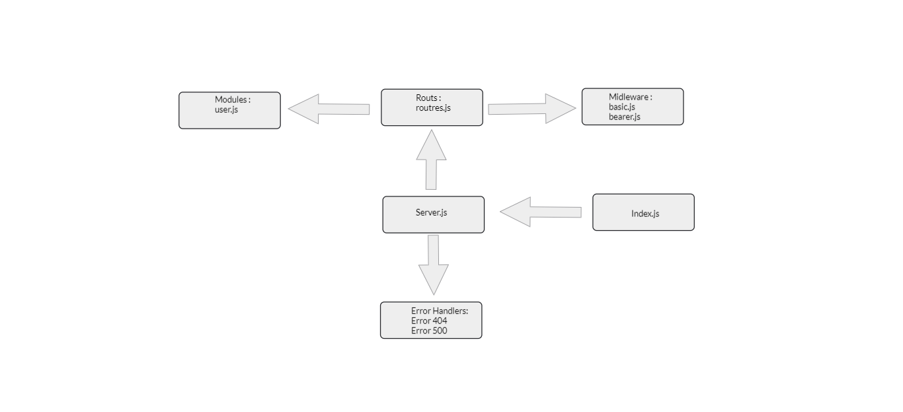

# Heroku :
[Herouko](https://reem-bearer-auth.herokuapp.com/)

# Github :
[Github](https://github.com/reem-alqurm/bearer-auth)
# pull request :
[Pull Request](https://github.com/reem-alqurm/bearer-auth/pulls?q=is%3Apr+is%3Aclosed)
# Github actions :
[Github Actions](https://github.com/reem-alqurm/bearer-auth/actions)

## UML Diagram :

